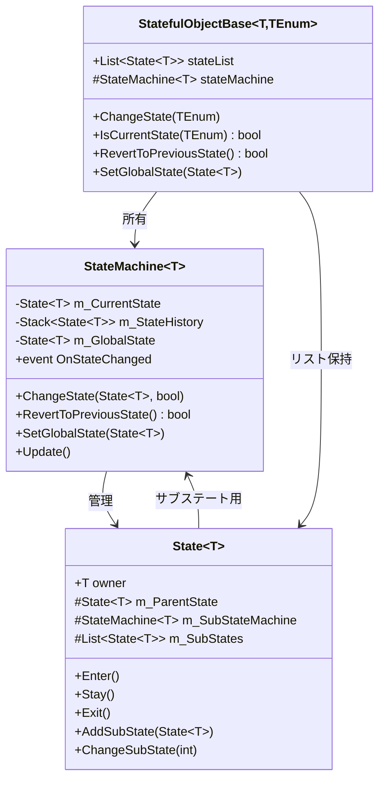
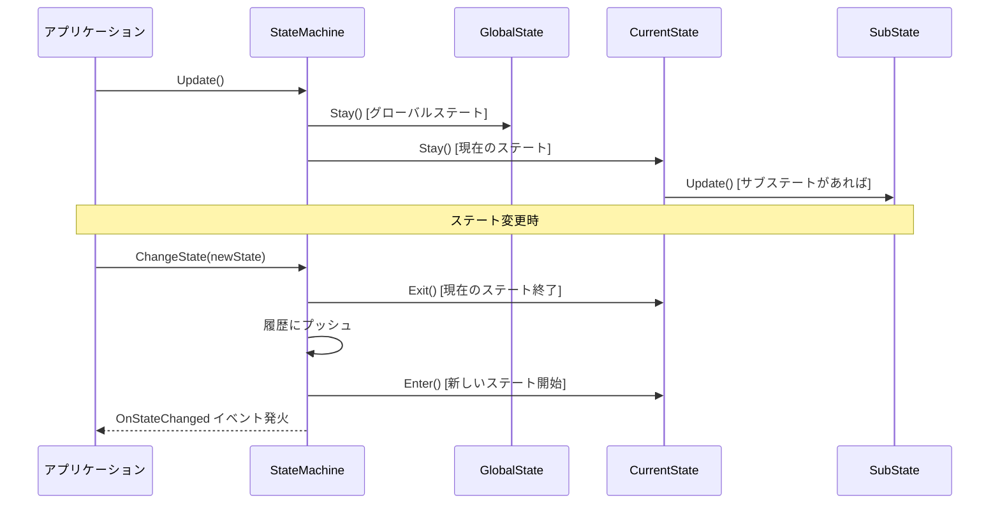

# ステートマシン使用書

本ドキュメントは、`StateMachineAI`名前空間で提供されるステートマシンシステムの使用方法を説明します。

---

## 目次

1. [概要](#概要)
2. [システム構成](#システム構成)
3. [基本的な使い方](#基本的な使い方)
4. [拡張機能](#拡張機能)
5. [変数命名規則](#変数命名規則)
6. [コード例](#コード例)
7. [APIリファレンス](#apiリファレンス)

---

## 概要

このステートマシンシステムは、AIやキャラクターの行動制御を状態(ステート)ベースで管理するためのフレームワークです。

### 主な特徴

- **汎用ジェネリック設計**: 任意の型をオーナーとして利用可能
- **ステート履歴スタック**: 前のステートに戻る機能
- **遷移イベント通知**: ステート変化を外部から監視可能
- **グローバルステート**: 全ステート共通で実行される処理
- **サブステート**: ステートの階層化（入れ子）をサポート

---

## システム構成

```
StateMachineAI/
├── StateMachine<T>         // ステートの管理・実行エンジン
├── State<T>                // 各ステートの基底クラス
└── StatefulObjectBase<T, TEnum>  // MonoBehaviour統合用抽象クラス
```

### クラス関係図



---

## 基本的な使い方

### ステップ1: ステート列挙型の定義

ステート遷移を管理するための列挙型を定義します。

```csharp
public enum AIState_ABType
{
    A_Mode,     // ステートリストの0番目
    B_Mode,     // ステートリストの1番目
}
```

> [!IMPORTANT]
> 列挙型の値の順番は、`stateList`に追加する順番と必ず一致させてください。

---

### ステップ2: ステートクラスの作成

`State<T>`を継承して、各ステートの具体的な処理を実装します。

```csharp
using UnityEngine;

namespace StateMachineAI
{
    public class S_TypeA : State<AITester>
    {
        // ワールド変数（メンバー変数）: m_ + 大文字始まり
        float m_Times;

        // コンストラクタ（必須）
        public S_TypeA(AITester owner) : base(owner) { }

        // ステート開始時に一度だけ呼ばれる（Startと同義）
        public override void Enter()
        {
            m_Times = 0.0f;
            Debug.Log("S_TypeAを起動しました!!");
        }

        // ステート中毎フレーム呼ばれる（Updateと同義）
        public override void Stay()
        {
            owner.transform.Rotate(new Vector3(1, 1, 1));
            
            if (m_Times > 5.0f)
            {
                // 他のステートへ遷移
                owner.ChangeState(AIState_ABType.B_Mode);
            }
            else
            {
                m_Times += 1.0f * Time.deltaTime;
            }
        }

        // ステート終了時に一度だけ呼ばれる（デストラクタと同義）
        public override void Exit()
        {
            // 終了処理
        }
    }
}
```

---

### ステップ3: 管理クラスの作成

`StatefulObjectBase<T, TEnum>`を継承して、ステートマシンを統合します。

```csharp
using UnityEngine;

namespace StateMachineAI
{
    public class AITester : StatefulObjectBase<AITester, AIState_ABType>
    {
        // ワールド変数（メンバー変数）
        public int m_Counter = 0;

        void Start()
        {
            // ステートをリストに追加（順番が重要！）
            stateList.Add(new S_TypeA(this));  // 0番目 = A_Mode
            stateList.Add(new S_TypeB(this));  // 1番目 = B_Mode

            // ステートマシンを初期化
            stateMachine = new StateMachine<AITester>();

            // 初期ステートを設定
            ChangeState(AIState_ABType.A_Mode);
        }
    }
}
```

---

## 拡張機能

### ステート履歴スタック

前のステートに戻る機能を提供します。

```csharp
// 前のステートに戻る（成功したらtrue）
bool success = owner.RevertToPreviousState();

// 履歴をクリア
owner.ClearStateHistory();

// 履歴の最大保持数を設定（デフォルト: 10）
owner.SetMaxHistoryCount(5);

// 現在の履歴数を取得
int count = owner.GetHistoryCount();
```

> [!NOTE]
> `ChangeState()`の第2引数を`false`にすると、履歴に保存せずに遷移できます。

---

### 遷移イベント通知

ステート変化を外部から監視できます。

```csharp
// イベントハンドラを定義
void OnStateChange(State<AITester> previousState, State<AITester> newState)
{
    Debug.Log($"ステート変更: {previousState} → {newState}");
}

// イベントを購読
owner.SubscribeStateChanged(OnStateChange);

// 購読を解除
owner.UnsubscribeStateChanged(OnStateChange);
```

---

### グローバルステート

全てのステートで共通して実行される処理を定義できます。

```csharp
// グローバルステートを作成
public class GlobalStateCheck : State<AITester>
{
    public GlobalStateCheck(AITester owner) : base(owner) { }

    public override void Stay()
    {
        // 常に実行される処理（例: 体力チェック）
        if (owner.health <= 0)
        {
            owner.ChangeState(AIState_ABType.Dead);
        }
    }
}

// グローバルステートを設定
void Start()
{
    // ... 通常のステート登録 ...
    
    // グローバルステートを設定
    SetGlobalState(new GlobalStateCheck(this));
}
```

> [!TIP]
> グローバルステートは現在のステートより**先に**実行されます。

---

### サブステート（階層化）

ステート内に子ステートを持たせて、状態の階層化を実現できます。

```csharp
public class CombatState : State<AITester>
{
    public CombatState(AITester owner) : base(owner)
    {
        // サブステートを追加
        AddSubState(new AttackSubState(owner));   // インデックス0
        AddSubState(new DefendSubState(owner));   // インデックス1
    }

    public override void Enter()
    {
        // 最初のサブステートを開始
        ChangeSubState(0);
    }

    public override void Stay()
    {
        // サブステートへの遷移条件をチェック
        // ローカル変数: m_なし + 小文字始まり
        bool shouldDefend = CheckDefenseNeeded();
        
        if (shouldDefend)
        {
            ChangeSubState(1);  // DefendSubStateへ遷移
        }
    }
}
```

#### サブステート関連メソッド

| メソッド | 説明 |
|---------|------|
| `AddSubState(State<T> subState)` | サブステートを追加 |
| `ChangeSubState(int index)` | インデックス指定でサブステートに遷移 |
| `ChangeSubState(State<T> subState)` | ステート直接指定で遷移 |
| `HasSubStates()` | サブステートを持っているか確認 |
| `GetCurrentSubState()` | 現在のサブステートを取得 |
| `GetParentState()` | 親ステートを取得 |
| `GetSubStates()` | サブステートのリストを取得 |
| `GetSubStateCount()` | サブステートの数を取得 |

---

## 変数命名規則

本プロジェクトでは以下の命名規則を適用します。

| 種類 | ルール | 例 |
|------|--------|-----|
| **ワールド変数（メンバー変数）** | `m_` + 大文字始まり | `m_Times`, `m_Counter`, `m_CurrentHealth` |
| **ローカル変数** | `m_`なし + 小文字始まり | `times`, `counter`, `currentHealth` |

### 例

```csharp
public class ExampleState : State<AITester>
{
    // ワールド変数（メンバー変数）
    private float m_ElapsedTime;
    private bool m_IsActive;
    private int m_AttackCount;

    public ExampleState(AITester owner) : base(owner) { }

    public override void Stay()
    {
        // ローカル変数
        float deltaTime = Time.deltaTime;
        bool shouldAttack = m_ElapsedTime > 3.0f;

        if (shouldAttack)
        {
            int damage = CalculateDamage();  // ローカル変数
            m_AttackCount++;                  // メンバー変数をインクリメント
        }

        m_ElapsedTime += deltaTime;
    }
}
```

---

## コード例

### 動的なステート登録

リフレクションを使用して、クラス名からステートを動的に生成できます。

```csharp
/// <summary>
/// クラス名を元にステートを生成して追加する
/// </summary>
/// <param name="className">生成するクラスの名前</param>
public bool AddStateByName(string className)
{
    try
    {
        // 現在のアセンブリからクラスを取得
        Type stateType = Assembly.GetExecutingAssembly()
            .GetType($"StateMachineAI.{className}");

        if (stateType == null)
        {
            Debug.LogError($"{className} クラスが見つかりませんでした。");
            return false;
        }

        // 型チェック
        if (!typeof(State<AITester>).IsAssignableFrom(stateType))
        {
            Debug.LogError($"{className} は State<AITester> 型ではありません。");
            return false;
        }

        // インスタンスを生成
        ConstructorInfo constructor = stateType.GetConstructor(new[] { typeof(AITester) });
        
        if (constructor == null)
        {
            Debug.LogError($"{className} のコンストラクタが見つかりませんでした。");
            return false;
        }

        State<AITester> stateInstance = constructor.Invoke(new object[] { this }) as State<AITester>;
        
        if (stateInstance != null)
        {
            stateList.Add(stateInstance);
            return true;
        }

        return false;
    }
    catch (Exception ex)
    {
        Debug.LogError($"エラー: {ex.Message}");
        return false;
    }
}
```

### ステートの動的置換

実行時にステートを別のステートに置き換える例：

```csharp
public override void Enter()
{
    // m_Counter が 2 を超えたら、B_Mode のステートを S_TypeC に置き換える
    if (owner.m_Counter > 2)
    {
        owner.stateList[1] = new S_TypeC(owner);
    }
}
```

---

## APIリファレンス

### StateMachine\<T\>

| プロパティ/メソッド | 説明 |
|------------------|------|
| `CurrentState` | 現在のステートを取得 |
| `HistoryCount` | 履歴の数を取得 |
| `ChangeState(State<T>, bool)` | ステートを変更（第2引数: 履歴保存フラグ） |
| `RevertToPreviousState()` | 前のステートに戻る |
| `SetGlobalState(State<T>)` | グローバルステートを設定 |
| `GetGlobalState()` | グローバルステートを取得 |
| `ClearHistory()` | 履歴をクリア |
| `SetMaxHistoryCount(int)` | 履歴の最大数を設定 |
| `Update()` | 毎フレーム呼び出す（グローバル→現在→サブの順で実行） |
| `OnStateChanged` | ステート変更時のイベント |

### State\<T\>

| プロパティ/メソッド | 説明 |
|------------------|------|
| `owner` | このステートを利用するインスタンス |
| `Enter()` | ステート開始時に呼ばれる（オーバーライド可能） |
| `Stay()` | ステート中毎フレーム呼ばれる（オーバーライド可能） |
| `Exit()` | ステート終了時に呼ばれる（オーバーライド可能） |
| `AddSubState(State<T>)` | サブステートを追加 |
| `ChangeSubState(int)` | インデックス指定でサブステートに遷移 |
| `ChangeSubState(State<T>)` | ステート直接指定で遷移 |
| `HasSubStates()` | サブステートを持っているか確認 |
| `UpdateSubStates()` | サブステートを更新 |
| `GetParentState()` | 親ステートを取得 |
| `GetCurrentSubState()` | 現在のサブステートを取得 |
| `GetSubStates()` | サブステートのリストを取得 |
| `GetSubStateCount()` | サブステートの数を取得 |

### StatefulObjectBase\<T, TEnum\>

| プロパティ/メソッド | 説明 |
|------------------|------|
| `stateList` | 登録されたステートのリスト |
| `stateMachine` | ステートマシンインスタンス |
| `ChangeState(TEnum)` | 列挙型でステートを変更 |
| `IsCurrentState(TEnum)` | 指定したステートが現在のステートか確認 |
| `RevertToPreviousState()` | 前のステートに戻る |
| `SetGlobalState(State<T>)` | グローバルステートを設定 |
| `GetGlobalState()` | グローバルステートを取得 |
| `SubscribeStateChanged(Action)` | ステート変更イベントを購読 |
| `UnsubscribeStateChanged(Action)` | 購読を解除 |
| `ClearStateHistory()` | 履歴をクリア |
| `SetMaxHistoryCount(int)` | 履歴の最大数を設定 |
| `GetHistoryCount()` | 履歴の数を取得 |

---

## ライフサイクル図



---

## ステートごとの関数一覧

各ステートタイプで使用できる関数とその説明を一覧でまとめます。

### 通常ステート（State\<T\>を継承）

| 関数名 | 呼び出しタイミング | 説明 |
|--------|-------------------|------|
| `Enter()` | ステート開始時（1回） | 初期化処理。アニメーション開始、変数リセットなど |
| `Stay()` | ステート中（毎フレーム） | メイン処理。状態監視、遷移条件チェックなど |
| `Exit()` | ステート終了時（1回） | 終了処理。リソース解放、フラグリセットなど |

#### 通常ステートで使用できるプロパティ・メソッド

| 名前 | 型/戻り値 | 説明 |
|------|----------|------|
| `owner` | `T` | このステートを利用するオブジェクト（例: `AITester`） |
| `owner.ChangeState(Enum)` | `void` | 別のステートへ遷移 |
| `owner.RevertToPreviousState()` | `bool` | 前のステートに戻る |
| `owner.IsCurrentState(Enum)` | `bool` | 指定したステートが現在のステートか確認 |

---

### グローバルステート

| 関数名 | 呼び出しタイミング | 説明 |
|--------|-------------------|------|
| `Enter()` | グローバルステート設定時（1回） | 監視開始時の初期化 |
| `Stay()` | 毎フレーム（現在ステートより**先**に実行） | 常時監視処理。HP監視、入力監視など |
| `Exit()` | グローバルステート解除時（1回） | 監視終了時の処理（通常は呼ばれない） |

#### グローバルステートの主な用途

| 用途 | 説明 |
|------|------|
| HP監視 | HPが0になったら死亡ステートへ強制遷移 |
| 入力監視 | 特定のキー入力でステートを強制遷移 |
| デバッグ | 常にログ出力やステータス表示 |
| 緊急割り込み | 被弾や強制中断などの処理 |

#### グローバルステート設定方法

```csharp
// 設定
SetGlobalState(new S_GlobalMonitor(this));

// 取得
State<AITester> globalState = GetGlobalState();
```

---

### サブステート（親ステート側で使用）

| 関数名 | 説明 |
|--------|------|
| `AddSubState(State<T> subState)` | サブステートを追加（インデックスは追加順） |
| `ChangeSubState(int index)` | インデックス指定でサブステートに遷移 |
| `ChangeSubState(State<T> subState)` | ステート直接指定で遷移 |
| `HasSubStates()` | サブステートを持っているか確認（`bool`） |
| `GetCurrentSubState()` | 現在のサブステートを取得 |
| `GetSubStates()` | サブステートのリストを取得 |
| `GetSubStateCount()` | サブステートの数を取得（`int`） |

---

### サブステート（子ステート側で使用）

| 関数名 | 説明 |
|--------|------|
| `GetParentState()` | 親ステートを取得 |
| `GetParentState()?.ChangeSubState(index)` | 親経由で次のサブステートへ遷移 |
| `owner.RevertToPreviousState()` | 親ステートを含めて前のステートに戻る |

#### サブステートのライフサイクル

| 関数名 | 呼び出しタイミング | 説明 |
|--------|-------------------|------|
| `Enter()` | サブステート開始時（1回） | サブ処理の初期化 |
| `Stay()` | サブステート中（毎フレーム） | サブ処理のメイン。遷移条件チェック |
| `Exit()` | サブステート終了時（1回） | サブ処理の終了 |

---

### 管理クラス（StatefulObjectBase\<T, TEnum\>を継承）

| 関数名 | 説明 |
|--------|------|
| `ChangeState(TEnum state)` | Enum指定でステートを変更 |
| `IsCurrentState(TEnum state)` | 現在のステートと一致するか確認 |
| `RevertToPreviousState()` | 前のステートに戻る |
| `SetGlobalState(State<T> state)` | グローバルステートを設定 |
| `GetGlobalState()` | グローバルステートを取得 |
| `SubscribeStateChanged(Action)` | ステート変更イベントを購読 |
| `UnsubscribeStateChanged(Action)` | イベント購読を解除 |
| `ClearStateHistory()` | 履歴をクリア |
| `SetMaxHistoryCount(int count)` | 履歴の最大数を設定 |
| `GetHistoryCount()` | 履歴の数を取得 |

---

## 更新履歴

| 日付 | 内容 |
|------|------|
| 2026/01/16 | StateManager連携機能追加、enumからSearch削除、グローバルステート動的設定対応 |
| 2026/01/15 | 初版作成 - 拡張機能（履歴スタック、イベント通知、グローバルステート、サブステート）対応版 |

---

## StateManagerとの連携

AITesterをStateManagerと連携させることで、インスペクター上から完全にAI構成を制御できます。

### 新しいAITester API

| メソッド | 説明 |
|---------|------|
| `Initialize()` | コンポーネント取得とステートマシン初期化 |
| `SetupGlobalStateByName(string)` | クラス名からグローバルステートを設定 |
| `AddStateByName(string)` | クラス名からステートを追加 |
| `StartStateMachine(AIState_Type)` | ステートマシンを開始 |

### 使用例

```csharp
// StateManager.SetUp() での使用例
AITester stateM = chara.GetComponent<AITester>();
stateM.m_Player = m_Player;

// 1. 初期化
stateM.Initialize();

// 2. グローバルステート設定
stateM.SetupGlobalStateByName("S_Search");

// 3. ステート登録
stateM.AddStateByName("S_Idle");
stateM.AddStateByName("S_Attack");
stateM.AddStateByName("S_Tracking");
stateM.AddStateByName("S_Hit");
stateM.AddStateByName("S_Die");

// 4. 開始
stateM.StartStateMachine(AIState_Type.Idle);
```

> [!IMPORTANT]
> `AddStateByName()`の呼び出し順序は、`AIState_Type` enumの定義順序と一致させてください。

詳細は [StateManager使用書](./StateManager使用書.md) を参照してください。
