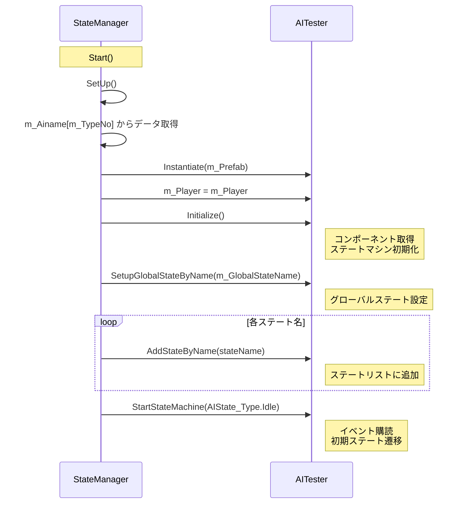

# StateManager使用書

本ドキュメントは、`StateManager`を使用してAIキャラクターを動的に生成・構成する方法を説明します。

---

## 目次

1. [概要](#概要)
2. [インスペクター設定](#インスペクター設定)
3. [AINames構造体](#ainames構造体)
4. [処理フロー](#処理フロー)
5. [新しいAIタイプの追加方法](#新しいaiタイプの追加方法)
6. [APIリファレンス](#apiリファレンス)

---

## 概要

`StateManager`は、AIキャラクターの生成とステートマシン構成をインスペクター上から完全に制御するためのコンポーネントです。

### 主な特徴

- **複数AIタイプ対応**: 異なるプレハブ・ステート構成を切り替え可能
- **動的ステート登録**: クラス名からステートを動的に生成
- **グローバルステート**: タイプごとに異なるグローバルステートを設定可能
- **プレハブ管理**: タイプごとに異なるプレハブを使用可能

---

## インスペクター設定

| フィールド | 説明 |
|----------|------|
| `m_TypeNo` | 使用するAIタイプの番号（0始まり） |
| `m_Player` | プレイヤーのTransform |
| `m_Ainame` | AIタイプごとの設定リスト |

---

## AINames構造体

各AIタイプの設定データを格納する構造体です。

```csharp
[System.Serializable]
public struct AINames
{
    [Header("敵の名前(ニックネーム)")]
    public string m_TypeName;
    
    [Header("出現させるプレハブ")]
    public GameObject m_Prefab;
    
    [Header("グローバルステートのクラス名")]
    public string m_GlobalStateName;
    
    [Header("使用するステートのリスト")]
    public List<string> m_AIName;
}
```

### 各フィールドの説明

| フィールド | 説明 | 例 |
|----------|------|-----|
| `m_TypeName` | 識別用の名前 | "ゴブリン", "スライム" |
| `m_Prefab` | 生成するプレハブ | ゴブリンのプレハブ |
| `m_GlobalStateName` | グローバルステートのクラス名 | "S_Search" |
| `m_AIName` | ステートクラス名のリスト | ["S_Idle", "S_Attack", ...] |

> [!IMPORTANT]
> `m_AIName`リストの順番は、`AIState_Type` enumの定義順序と一致させてください。

---

## 処理フロー



---

## 新しいAIタイプの追加方法

### ステップ1: インスペクターでリストに追加

1. `StateManager`コンポーネントを選択
2. `m_Ainame`リストの`+`ボタンをクリック
3. 各フィールドを設定

### ステップ2: 設定例

| フィールド | 値 |
|----------|-----|
| m_TypeName | "ゴブリン" |
| m_Prefab | GoblinPrefab |
| m_GlobalStateName | "S_Search" |
| m_AIName[0] | "S_Idle" |
| m_AIName[1] | "S_Attack" |
| m_AIName[2] | "S_Tracking" |
| m_AIName[3] | "S_Hit" |
| m_AIName[4] | "S_Die" |

### ステップ3: タイプ番号を設定

`m_TypeNo`に使用したいタイプのインデックスを設定します。

---

## 現在のAIState_Type

```csharp
public enum AIState_Type
{
    Idle,       // 0: 待機
    Attack,     // 1: 攻撃
    Tracking,   // 2: 追跡
    Hit,        // 3: 被弾
    Die,        // 4: 死亡
    Retreat,    // 5: 後退
}
```

> [!NOTE]
> `Search`はグローバルステート専用になったため、enumから削除されました。

---

## APIリファレンス

### StateManager

| フィールド/メソッド | 説明 |
|------------------|------|
| `m_TypeNo` | 使用するAIタイプの番号 |
| `m_Player` | プレイヤーのTransform |
| `m_Ainame` | AIタイプ設定のリスト |
| `Start()` | 開始時にSetUp()を呼び出す |
| `SetUp()` | AIキャラクターを生成・初期化 |
| `ChangePrefab()` | （未実装）プレハブ切り替え用 |

### AITester（StateManager連携用API）

| メソッド | 説明 |
|---------|------|
| `Initialize()` | コンポーネント取得とステートマシン初期化 |
| `SetupGlobalStateByName(string)` | クラス名からグローバルステートを設定 |
| `AddStateByName(string)` | クラス名からステートをリストに追加 |
| `StartStateMachine(AIState_Type)` | イベント購読と初期ステート遷移 |

---

## 注意事項

> [!WARNING]
> - プレハブには`AITester`コンポーネントが必要です
> - ステートクラスは`StateMachineAI`名前空間に配置してください
> - enumの順番とAddStateByNameの呼び出し順序を一致させてください

---

## 更新履歴

| 日付 | 内容 |
|------|------|
| 2026/01/17 | 後退（Retreat）ステートの追加、EnemyDataへのパラメータ追加 |
| 2026/01/16 | 初版作成 |
