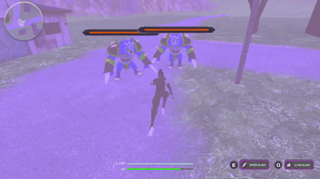
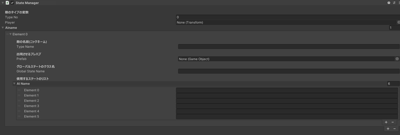
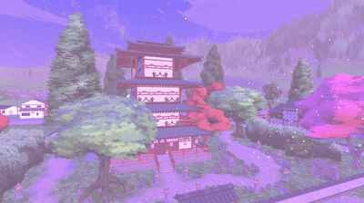
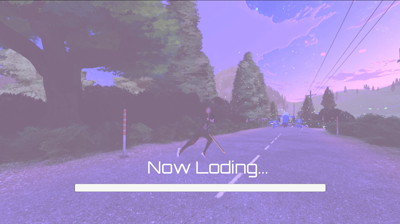
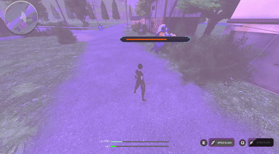

# 3DCombat

Unityで制作した3Dアクションゲームです。  
コンボシステムや必殺技、カメラ演出を実装し、
「戦闘の爽快感」を重視して開発しました。

---

## 主な実装要素

- コンボシステム
- Cinemachine連動カメラ演出
- ジェネリクスを活用した敵AI
- UniTaskによる非同期制御
- 距離判定による動的UI表示

---

## 使用技術

- Unity
- C#
- Animator
- Cinemachine
- UniTask

---

## 実装内容

### 戦闘システム

近接アクションの手触り向上を目的として、
コンボ・吸い付き・ヒット判定調整を実装。

- コンボシステム
- ヒット判定調整
- 敵へのターゲット処理
- 攻撃時の吸い付き処理
- 武器の出し入れシステム

---

### 敵AI

ジェネリクスを活用した自作ステートマシンを使用し、
状態追加や変更をしやすい構成を意識して設計。

- 索敵
- 追跡
- 攻撃
- 撤退
- 状態遷移制御

---

### UI

プレイヤー状況や敵との距離に応じて、
必要な情報のみ表示するUIを実装。

- チュートリアルUI
- 距離連動型HPバー
- 特定エリアでのテキスト表示
- ミニマップ
- 各種メニュー画面
  - 設定
  - 音量調整

　　

---

### 演出

戦闘システムとカメラ演出を連動させ、
攻撃時の迫力向上を意識して実装。

- 必殺技カメラ演出
- ボス撃破時カメラ演出
- 敵撃破時のDissolve演出
- タイトル画面のパララックス演出

---

### その他システム

- 非同期ローディング画面
  - プログレスバー付き
- 解放条件付きファストトラベル
- リスポーン機能

   

---

## 工夫した点

- ComboSystemのアニメーションイベントとCinemachineを連動させ、攻撃タイミングに合わせたカメラ揺れ・ズームを実装
- EnemyHPUnitにプレイヤーとの距離判定を組み込み、近距離の敵のみHPバーを表示
- ジェネリクスを活用した自作ステートマシンで敵AIを設計し、状態追加・変更をしやすい構成を意識
- UniTaskによる非同期処理を利用し、シーン遷移やボス演出制御を実装

---

## 担当箇所

### sogotoya

- コンボシステム
- ヒット判定調整
- ターゲット・吸い付き処理
- テレポート攻撃
- 必殺技演出
- カメラ制御
- 敵AIステートマシン
- UI実装
  - HPバー
  - チュートリアル
  - ミニマップ
  - メニュー
- 非同期ローディング画面
- ファストトラベル
- リスポーン機能
- 武器システム
- タイトル画面演出

---

### Abubu

- 初期プロジェクト構築
- Terrain・コライダー調整
- マップ導入
- プレイヤーモデル追加
- タイトル画面基礎作成
